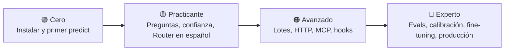

<div align="center">

# Laya Blueprint (ES)

**Guía de cero a experto, en español, para [Laya](https://github.com/NandhaKishorM/laya):
decisiones tipadas multilingües en milisegundos.**
Windows · Linux · macOS

[](GUIA-LAYA.md)
[](descargas/GUIA-LAYA.pdf)
[](https://github.com/NandhaKishorM/laya)
[](https://pypi.org/project/laya/0.3.22/)
[](LICENSE)
[](https://www.camilobernal.dev/?utm_source=github&utm_medium=readme&utm_campaign=laya-blueprint-es)

</div>

> [!IMPORTANT]
> Trabajo documental **independiente y no oficial**. Laya es un proyecto de **Convai Innovations**
> ([NandhaKishorM/laya](https://github.com/NandhaKishorM/laya)) publicado bajo la Apache License 2.0.
> Ver [`NOTICE`](NOTICE) y la sección de [licencia y atribución](GUIA-LAYA.md#licencia).

## ¿Qué encuentras aquí?

| | |
|---|---|
| 📘 [**GUIA-LAYA.md**](GUIA-LAYA.md) | La guía completa: 32 secciones en 7 partes, de la instalación a producción |
| ⬇️ [**descargas/GUIA-LAYA.pdf**](descargas/GUIA-LAYA.pdf) | Edición PDF lista para leer sin conexión (diagramas incluidos) |
| 🧪 [**ejemplos/**](ejemplos/) | Scripts ejecutables, preguntas para la CLI, dataset de evaluación, plantillas MCP y HTTP |
| ⚙️ [**scripts/build-guide.mjs**](scripts/build-guide.mjs) | Generador de las ediciones HTML y PDF |

## Ruta de aprendizaje



| Parte | Contenido |
|---|---|
| I · Fundamentos | Qué es Laya, arquitectura, árbol de decisión "¿es para mi caso?" |
| II · Instalación | Windows (PowerShell, CUDA, XPU), Linux (CPU, CUDA, Nix), macOS (MPS), uv, Docker |
| III · Uso | CLI, las tres primitivas, lectura de confianza, estados, **Router y español**, presets, `decide` |
| IV · Avanzado | Rendimiento, calibración y abstención, hooks, `laya-serve`, MCP, LangChain, TypeScript |
| V · Experto | `laya-evals` y gates en CI, fine-tuning, adopción por etapas, seguridad |
| VI · Aplicabilidad | Casos por sector: BFSI, gobierno (PQRSD), salud, transporte, educación, plataformas de IA |
| VII · Referencia | Troubleshooting (20+ síntomas), chuleta, glosario, recursos |

## Inicio en 60 segundos

```bash
python -m pip install laya
laya "Me cobraron dos veces la cuota" --json                              # enruta, sin descargar
laya "Me cobraron dos veces, quiero el reembolso" --preset triage --model multilingual
```

> [!TIP]
> **Si tu tráfico es mayoritariamente en español**, crea el router con `Router(default="multilingual")`.
> Frases cortas como "Quiero cancelar" no traen señal de idioma y, por defecto, se enrutan al
> checkpoint inglés. Detalles en la [sección 15](GUIA-LAYA.md#router).

## Ejemplos

| Archivo | Nivel | Qué muestra |
|---|---|---|
| [`01_hola_laya.py`](ejemplos/01_hola_laya.py) | 🟢 | Primer `predict` con las tres primitivas |
| [`02_pqrsd_gobierno.py`](ejemplos/02_pqrsd_gobierno.py) | 🟡 | Clasificación de PQRSD en lote con compuerta de revisión humana |
| [`03_lote_tickets.py`](ejemplos/03_lote_tickets.py) | 🟠 | Backlog de tickets → CSV con `predict_batch` y `sort_by_length` |
| [`04_decide_esquema.py`](ejemplos/04_decide_esquema.py) | 🟠 | Decisiones por JSON Schema y pydantic |
| [`datos/`](ejemplos/datos/) | — | `tickets.txt`, `preguntas_pqrsd.json` (CLI) y `eval_pqrsd.jsonl` (`laya-evals`) |
| [`mcp/`](ejemplos/mcp/) · [`http/`](ejemplos/http/) | — | Configuración de Claude Desktop y petición para `laya-serve` |

```bash
pip install "laya[structured]"
python ejemplos/01_hola_laya.py
laya-evals validate ejemplos/datos/eval_pqrsd.jsonl
```

## Regenerar el PDF y el HTML

```bash
npm ci
npx playwright install chromium    # o CHROMIUM_PATH=/ruta/a/chromium
npm run build                      # -> dist/GUIA-LAYA.pdf y dist/GUIA-LAYA.html
```

El workflow [`build-guide`](.github/workflows/build-guide.yml) genera ambas ediciones en cada cambio de
la guía (como artefacto) y las adjunta a un *Release* al publicar un tag `v*`.

## Contribuir

¿Encontraste un error, un comando que no funciona en tu sistema operativo o un caso de uso que falta?
Abre un issue o un pull request. Para errores de Laya en sí, usa el
[repositorio upstream](https://github.com/NandhaKishorM/laya/issues).

## Sobre el autor

Guía escrita y mantenida por **Camilo Bernal**, arquitecto de soluciones con más de 23 años de
experiencia en banca, salud, transporte, educación y gobierno.

> [!TIP]
> ¿Estás evaluando Laya, o decisiones con IA en general, para tu organización? En
> **[camilobernal.dev](https://www.camilobernal.dev/?utm_source=github&utm_medium=readme&utm_campaign=laya-blueprint-es)** encuentras mi trabajo en arquitectura empresarial,
> modernización e IA aplicada, y la forma de contactarme.

## Licencia

[Apache License 2.0](LICENSE). Material derivado de la documentación de Laya (Convai Innovations),
traducido y ampliado; ver [`NOTICE`](NOTICE).

---

<div align="center">

<sub>Hecho por <a href="https://www.camilobernal.dev/?utm_source=github&utm_medium=readme-footer&utm_campaign=laya-blueprint-es">Camilo Bernal · camilobernal.dev</a></sub>

</div>
